## 计算机毕业设计碾压导师Python+Django高考志愿填报推荐系统 高考分数线预测 高考预测 高考大数据分析 Hadoop PySpark 机器学习 深度学习 Python Scrapy分布式爬虫 机器学习 大数据毕业设计 数据仓库 大数据毕业设计 文本分类 LSTM情感分析 大数据毕业设计 知识图谱 大数据毕业设计 预测系统 实时计算 离线计算 数据仓库 人工智能 神经网络

## 要求
### 源码有偿！一套(论文 PPT 源码+sql脚本+教程)

### 
### 加好友前帮忙start一下，并备注github有偿纯python高考
### 我的QQ号是2827724252或者798059319或者 1679232425或者微信:bysj2023nb 或bysj1688

# 

### 加qq好友说明（被部分 网友整得心力交瘁）：
    1.加好友务必按照格式备注
    2.避免浪费各自的时间！
    3.当“客服”不容易，repo 主是体面人，不爆粗，性格好，文明人。

演示视频

https://www.bilibili.com/video/BV1jS411N7Nc/?spm_id_from=333.999.0.0

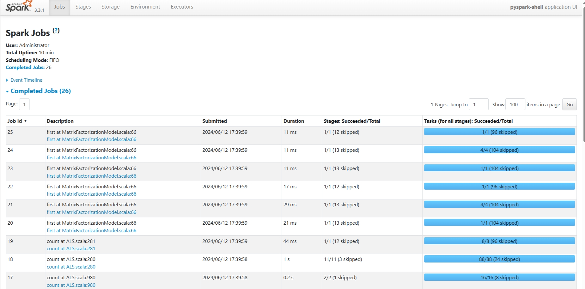
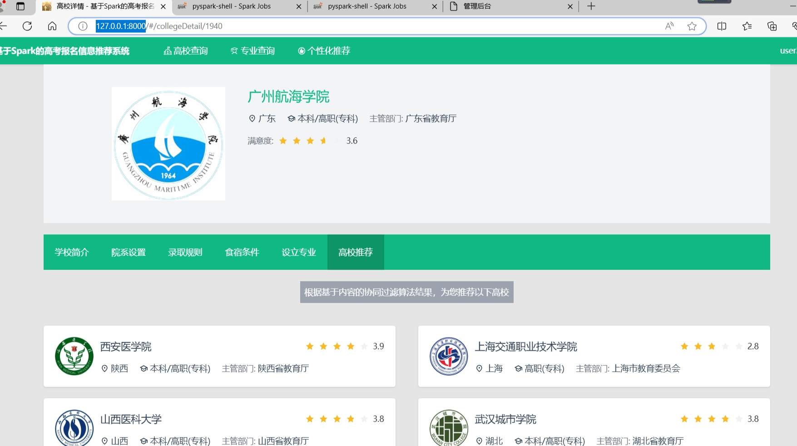
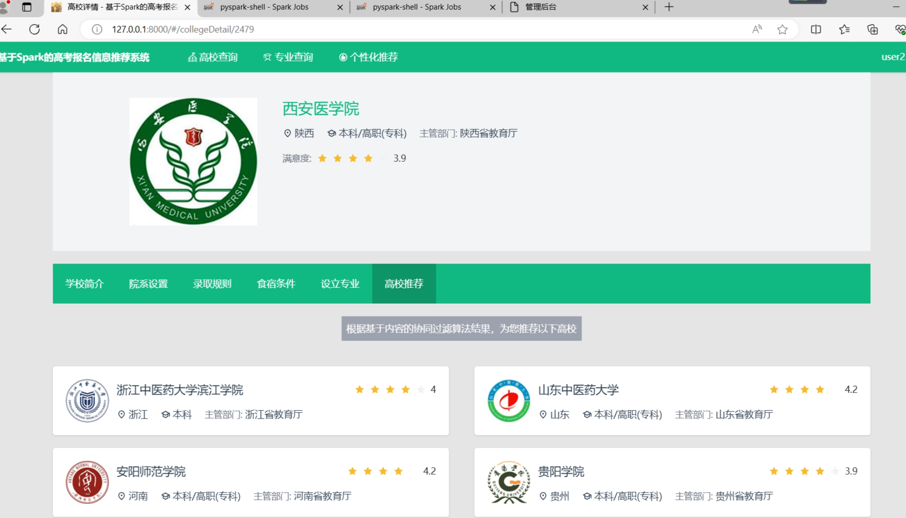
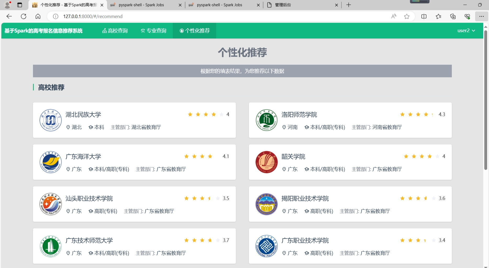
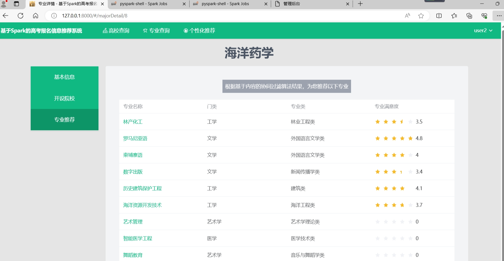
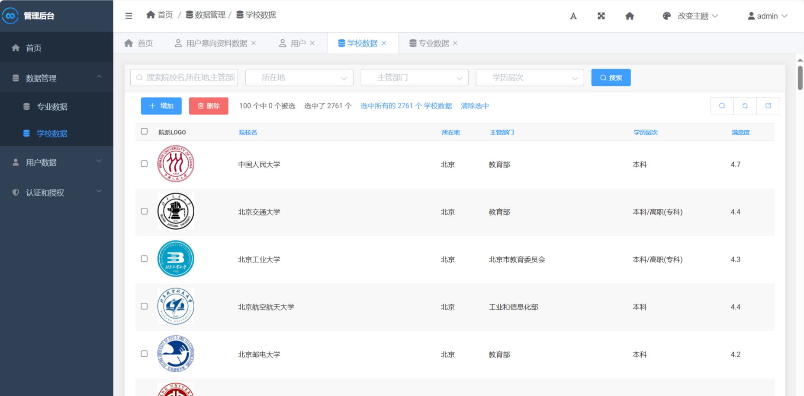
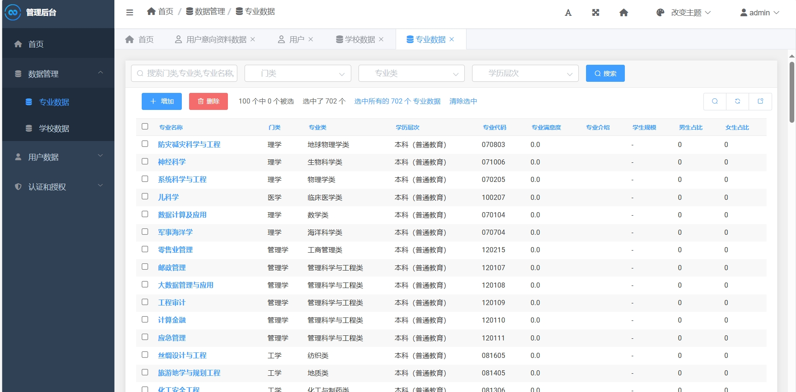
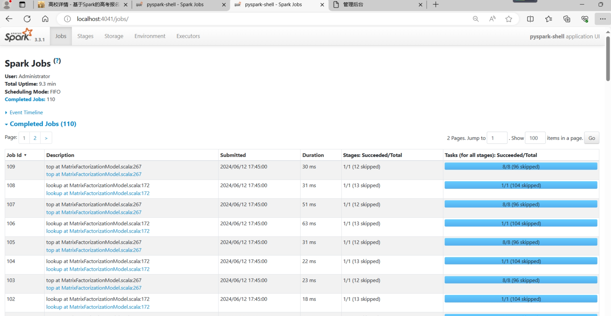
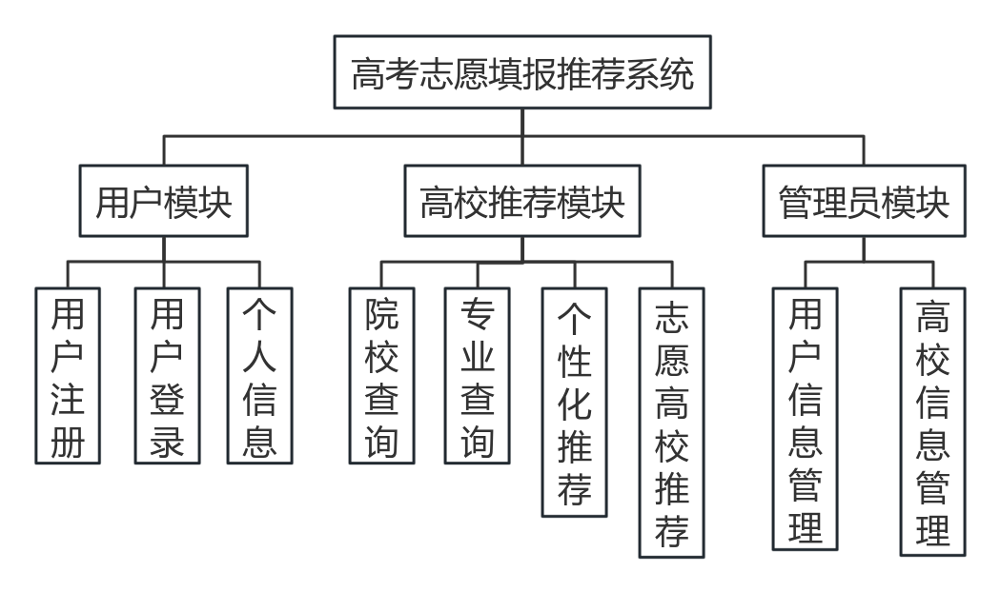
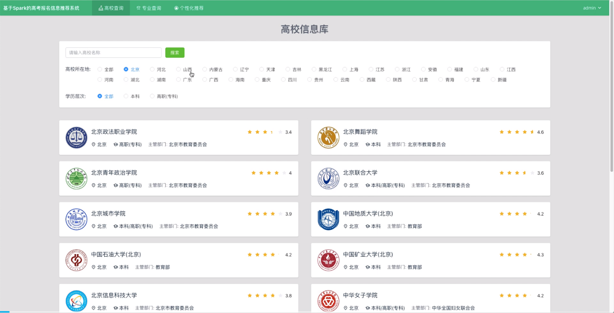

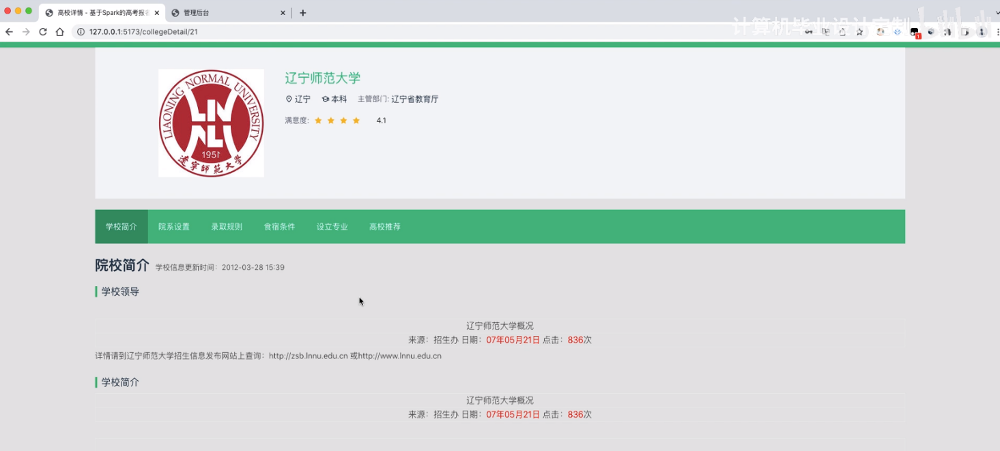
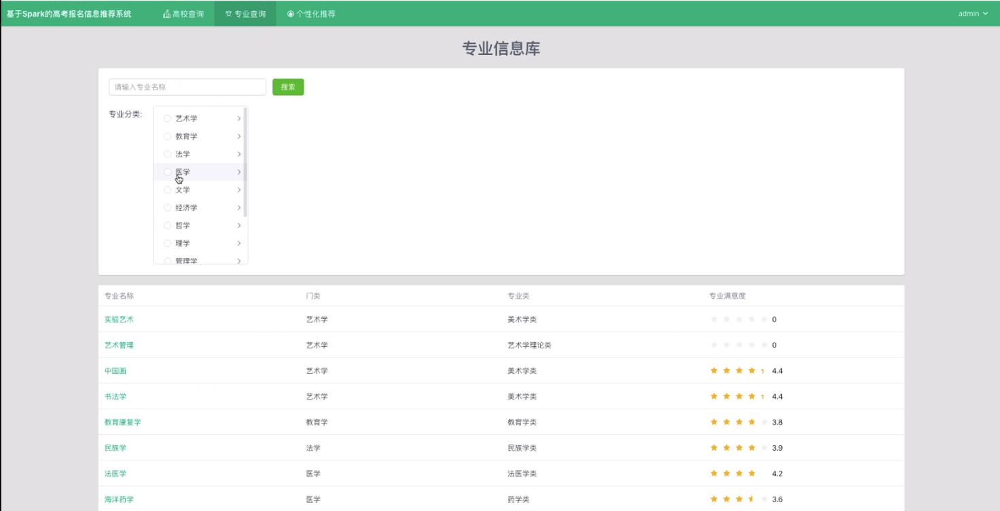
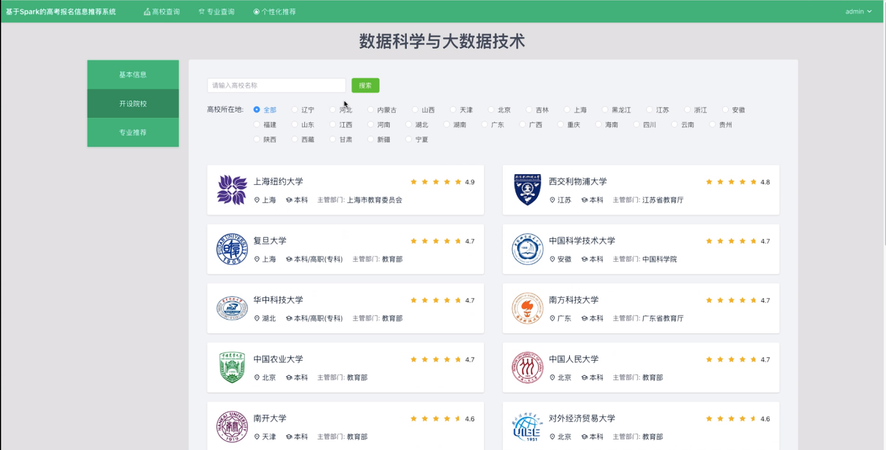
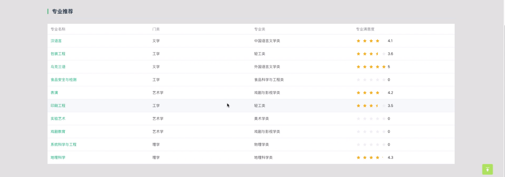
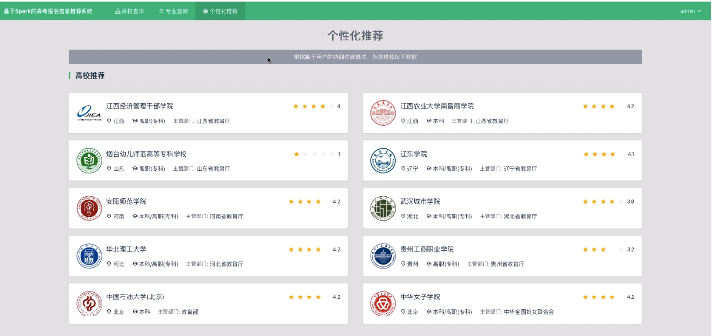
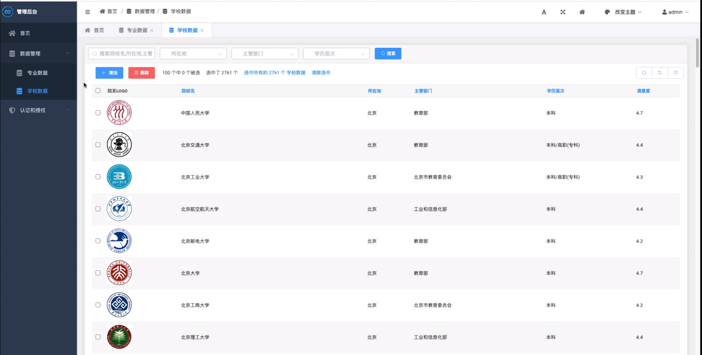

## 开发技术：
毕设介绍
基于Spark的高考报名信息推荐系统

系统用到的各项技术和工具的介绍：
    1. Python

    Python是一种高级的、解释型的程序设计语言，因为其简洁而易学、可读性强等特点，在数据处理、人工智能、机器学习、Web开发等领域得到了广泛运用。在该系统中，Python被用于编写后端服务器程序和数据处理脚本等。

    2. PySpark

    PySpark是Apache Spark的Python版本，是一个基于内存计算的大数据处理框架，具有高效和易用的特点。在该系统中，PySpark被用于进行数据处理和分析。

    3. Hadoop

    Hadoop是一个分布式文件系统和计算框架，能够处理大规模数据的存储和处理。在该系统中，Hadoop被用于存储和管理海量数据。

    4. Django

    Django是一款基于Python的Web应用程序开发框架，具有高度的可重用性、可扩展性和灵活性，被广泛地应用于Web开发领域。在该系统中，Django被用于编写后端API接口和管理界面。

    5. Scrapy

    Scrapy是一个Python编写的高效的网络爬虫框架，支持数据抓取和处理、自动化测试等功能。在该系统中，Scrapy被用于数据抓取模块的实现。

    6. Vue

    Vue是一个渐进式JavaScript框架，由Evan You在2014年创建。Vue具有简洁易学、组件化等特点，使用它可以快速地构建前端界面。在该系统中，Vue框架被用于实现前端页面渲染和数据展示。

    7. Element-Plus

    Element-Plus是一个Vue UI库，提供大量的UI组件和开发工具，可以帮助我们快速构建美观、易用的Web应用程序。在该系统中，Element-Plus被用于实现前端UI组件。

    8. 协同过滤算法

    协同过滤算法是一种通过挖掘用户历史行为数据来预测用户偏好并进行个性化推荐的算法。在该系统中，我们使用基于物品的协同过滤算法来实现高校和专业的推荐功能。

系统中各个模块的具体实现:

    1. 数据抓取模块

    该模块使用了Scrapy爬虫框架，通过访问“阳光高考”网站来抓取大学和专业相关数据。在抓取大学数据时，我们将获取学校名称、学校logo、简介、满意度、院系设置、录取规则、食宿条件、设立专业等字段；在抓取大学专业数据时，我们将获取学历层次、专业代码、所属门类、专业类别、介绍、相近专业、从业方向、统计了毕业生规模以及男女比例等信息。

    2. 用户注册登录模块

    该模块使用Django框架实现用户的注册和登录功能。在注册时，我们要求用户提供用户名、密码等必要信息，同时对用户输入进行合法性校验；在登录时，用户需要输入正确的用户名和密码才能成功登录系统。

    3. 后台管理模块

    该模块是系统管理员可以对系统中的数据进行管理操作的接口，包括大学和专业数据的增删改查。我们使用Django Admin框架实现后台管理功能。管理员登陆后，进入后台管理界面，就可以对系统中的数据进行增删改查的操作。

    4. 高校信息查询模块

    该模块是实现用户在高校名称关键词、高校所在地、学历层次等信息筛选出符合条件的国内高校的功能，该页面以卡片形式展示了高校信息。我们使用Vue+Element-Plus框架来实现前端页面渲染、数据展示和分页组件，使用Django框架来实现后端API接口。我们将20条数据为一页，以此来降低后端压力。

    5. 专业信息查询模块

    该模块是用户可以根据专业分类以及关键词等信息筛选出符合条件的大学专业数据的功能，该页面以表格形式展示了专业信息。我们同样使用Vue+Element-Plus框架来实现前端页面渲染、数据展示和分页组件，使用Django框架来实现后端API接口。

    6. 个性化推荐高校和专业模块

    该模块是根据用户在高考志愿填报模块所填写的预测成绩、喜欢的专业、喜欢的学校以及想去的省份所在地等信息，从数据库中查找出符合用户条件的高校以及专业数据，再个性化地推荐给用户的功能。我们使用基于物品的协同过滤算法实现系统的推荐功能，并使用Django框架实现后端API接口。

    7. 高校详情模块

    该模块是当用户查看某高校详情时，可以看到该高校的多种信息，比如院校简介、学校领导、周边环境、通讯地址、院校设置、重点实验室、重点学科、师资力量、录取条件、食宿条件等，还可以查看该学校设立的所有专业数据。该模块同样使用Vue+Element-Plus框架实现前端页面渲染、数据展示，使用Django框架实现后端API接口，并使用基于物品的协同过滤算法给用户推荐相似的高校数据。

    8. 专业详情模块

    该模块是当用户查看某专业的详情时，可以看到该专业的多种信息，比如学历层次、专业代码、所属门类，专业分类、专业介绍、统计信息包括该专业的毕业生规模和男女比例、相似专业、毕业后的从业方向。该模块同样使用Vue+Element-Plus框架实现前端页面渲染、数据展示，使用Django框架实现后端API接口，并使用基于物品的协同过滤算法给用户推荐相似的专业数据。

技术及功能关键词:
    python pyspark hadoop django scrapy vue element-plus 协同过滤算法 
    通过scrapy爬虫框架抓取“阳光高考”网站上的大学数据(包括了学校名称、学校logo、简介、满意度、院系设置、录取规则、食宿条件、设立专业等字段)以及大学的专业(包括了学历层次、专业代码、所属门类、专业类别、介绍、相近专业、从业方向、统计了毕业生规模以及男女比例等信息)数据 
    前台用户通过登陆注册后进入系统
    管理员可在后台管理所有抓取到的大学及大学专业数据，以及用户填写的高考志愿意向数据
    高校信息查询模块，用户可以根据高校名称关键词、高校所在地、学历层次等信息筛选出符合条件的国内高校，该页面以卡片形式展示了高校信息，其中包括了高校名称、高校LOGO、所在地、学历层次、主管部门以及高校评分等数据，分页组件以20条数据为一页，可大大降低后端压力
    专业信息查询模块，用户可以根据专业分类以及关键词等信息筛选出符合条件的大学专业数据，该页面以表格形式展示了专业信息，其中包括专业名称、专业所属门类、专业所属类以及专业满意度等信息
    个性化推荐高校和专业模块，这是根据用户在高考志愿填报模块所填写的预测成绩、喜欢的专业、喜欢的学校以及想去的省份所在地等信息，在数据库中查找出符合用户条件的高校以及专业数据，再个性化地推荐给用户；需要注意的是，当用户第一次访问该模块时，系统会检测用户是否已填写志愿，如果没有，必须填写后才能够推荐
    当用户查看某高校详情时，可以看到该高校的多种信息，比如院校简介、学校领导、周边环境、通讯地址、院校设置、重点实验室、重点学科、师资力量、录取条件、食宿条件等，还可以查看该学校设立的所有专业数据，同时系统会依据基于物品的协同过滤算法给用户推荐相似的高校数据
    当用户查看某专业的详情时，可以看到该专业的多种信息，比如学历层次、专业代码、所属门类，专业分类、专业介绍、统计信息包括该专业的毕业生规模和男女比例、相似专业、毕业后的从业方向。也可以看到该专业有哪些高校设立，同时系统会依据基于物品的协同过滤算法给用户推荐相似的专业数据

目录结构(只关注标注了中文的):
    ├── app 高校或专业数据后端最重要的模块！！！
    │   ├── __init__.py
    │   ├── admin.py 后台显示数据的配置
    │   ├── apps.py 协同过滤算法代码！！！
    │   ├── migrations
    │   │   └── __init__.py
    │   ├── models.py 高校或专业相关的数据库模型
    │   ├── tests.py
    │   ├── urls.py
    │   └── views.py 高校或专业相关所有重要的后端代码！！！！！
    ├── auth 用户登陆注册模块
    │   ├── __init__.py
    │   ├── admin.py
    │   ├── apps.py
    │   ├── migrations
    │   │   └── __init__.py
    │   ├── models.py
    │   ├── tests.py
    │   ├── urls.py
    │   └── views.py 登陆注册的代码！
    ├── college_recommend_system
    │   ├── __init__.py
    │   ├── asgi.py
    │   ├── settings.py 后端配置文件
    │   ├── urls.py 路由配置文件
    │   └── wsgi.py
    ├── db.sqlite3
    ├── dist
    │   ├── assets
    │   │   ├── detail.13d47c10.js
    │   │   ├── detail.1fa341c4.css
    │   │   ├── detail.337af02b.css
    │   │   ├── detail.54f10f8e.js
    │   │   ├── detail.742aa084.js
    │   │   ├── detail.7889713c.js
    │   │   ├── detail.7ef48dc3.js
    │   │   ├── detail.ee7f2c45.js
    │   │   ├── detail.f7625290.js
    │   │   ├── detail.fb8a31e4.js
    │   │   ├── index.13fd7688.js
    │   │   ├── index.162580f2.js
    │   │   ├── index.1691dcfa.js
    │   │   ├── index.2550ca4f.css
    │   │   ├── index.284f6351.css
    │   │   ├── index.298ea03e.css
    │   │   ├── index.37b9f46a.js
    │   │   ├── index.3909a248.js
    │   │   ├── index.3c36e44f.js
    │   │   ├── index.3dba9fc9.css
    │   │   ├── index.40b7da8f.css
    │   │   ├── index.5aab477e.js
    │   │   ├── index.6cca87c9.js
    │   │   ├── index.7538b07b.js
    │   │   ├── index.803ad225.js
    │   │   ├── index.8c5a47f0.js
    │   │   ├── index.8fdc67f4.js
    │   │   ├── index.9164ad62.js
    │   │   ├── index.94b35005.js
    │   │   ├── index.a3c8cee7.js
    │   │   ├── index.a80fb208.css
    │   │   ├── index.aa7d4a1b.js
    │   │   ├── index.c9868bac.js
    │   │   ├── index.e360ba0e.js
    │   │   ├── index.e675f45b.css
    │   │   ├── index.f173cc06.js
    │   │   ├── login.25adad7b.js
    │   │   ├── login.3faad2ee.js
    │   │   ├── login.73bcb05c.js
    │   │   ├── login.9fa974fc.js
    │   │   ├── login.f552d11e.css
    │   │   ├── register.00476390.js
    │   │   ├── register.0bec7e5f.js
    │   │   ├── register.43303d71.js
    │   │   ├── register.73548925.css
    │   │   └── register.75406bd0.js
    │   └── index.html
    ├── fake.py
    ├── frontend
    │   ├── README.md
    │   ├── index.html
    │   ├── package-lock.json
    │   ├── package.json
    │   ├── public
    │   ├── src
    │   │   ├── App.vue
    │   │   ├── assets
    │   │   ├── components
    │   │   ├── directives
    │   │   ├── layout_h
    │   │   ├── layout_v
    │   │   ├── main.js
    │   │   ├── mixins
    │   │   ├── router
    │   │   ├── stores
    │   │   ├── utils
    │   │   └── views 前端源代码，前台所有页面的代码都在这！！！
    │   └── vite.config.js
    ├── index
    │   ├── __init__.py
    │   ├── admin.py
    │   ├── apps.py
    │   ├── migrations
    │   │   └── __init__.py
    │   ├── models.py
    │   ├── tests.py
    │   ├── urls.py
    │   ├── utils.py
    │   └── views.py
    ├── manage.py
    ├── middlewares
    │   └── __init__.py
    ├── requirements.txt
    ├── scrapy.cfg
    ├── spider
    │   ├── __init__.py
    │   ├── extendsion
    │   │   ├── __init__.py
    │   │   └── selenium
    │   ├── items.py
    │   ├── middlewares.py
    │   ├── pipelines.py 将数据入库的代码
    │   ├── settings.py 
    │   └── spiders
    │       ├── __init__.py
    │       ├── college.py 高校爬虫
    │       ├── major.py 专业爬虫
    │       ├── rel.py 将高校与专业关联起来的爬虫
    │       └── test.py
    └── 项目介绍.txt
	
	
## 毕业设计工作的进展情况(不少于3000字)
1.需求分析
1)系统目标
基于Spark的高考报名信息推荐系统是一款基于Spark的分布式平台的高考报名信息推荐系统，它可以有效地收集、清洗、分析、训练和预测高考报名信息，从而更好地推荐高考报名信息，从而提高考生的报考效率，减少考生的报考成本，提高考生的报考质量。该系统使用Hadoop，Spark，协同过滤算法等技术，可以实现查询高校，查询专业，个性化推荐院校等功能，为考生提供更加便捷的报考信息查询和推荐服务。
2)系统可行性分析:
（1）技术可行性分析 
Hadoop是一个分布式计算框架，可以有效地实现大数据的存储和分析，即Hadoop可以有效地实现高考报名信息的收集、清洗、分析、训练和预测等功能，因此，Hadoop在该系统中是可行的。Spark是一个分布式计算框架，可以有效地实现大数据的存储和分析，因此，Spark可以有效地实现高考报名信息的收集、清洗、分析、训练和预测等功能，因此，Spark在该系统中是可行的。协同过滤算法：协同过滤算法是一种基于用户行为的推荐算法，可以有效地实现个性化推荐院校等功能，因此，协同过滤算法在该系统中是可行的。 
（2）经济可行性分析 
Hadoop、Spark和协同过滤算法都是开源的技术，即该系统的开发成本较低，因为使用的技术都是目前比较成熟的技术，而且使用的技术都是开源的。Spark框架能够将服务产生的中间数据存放在内存中，避免了因为读写次数过多而导致的损耗．此外，Spark框架还提出了一种新的模型—分布式粗糙集库扩展模型．Spark框架在进行数据分析处理时没有将数据存放在硬盘中，而是直接使用内存临时存放，进而降低了数据处理所用的时间。因此，该系统的经济可行性较高。 
（3）社会可行性分析
该系统可以有效地收集、清洗、分析、训练和预测高考报名信息，从而更好地推荐高考报名信息，从而提高考生的报考效率，减少考生的报考成本，提高考生的报考质量；该系统可以有效地收集、清洗、分析、训练和预测高考报名信息，从而更好地推荐高考报名信息，从而提高考生的报考效率，减少考生的报考成本，提高考生的报考质量。
综上所述，基于Spark的高考报名信息推荐系统具有较高的技术可行性、经济可行性和社会可行性，因此，该系统是可行的。
（3）系统的功能性需求分析
基于Spark的高考报名信息推荐系统通过高考信息填报推荐系统实现对用户的期望院校个性化推荐，满足用户对目标院校的搜索需求，保证系统可以为不同的用户推荐各自喜欢的、合适的院校和专业，发挥推荐系统的优势。该系统平台将包含用户模块，高校推荐模块，管理员模块三个部分
其系统主要有两种类型的用户：普通用户和管理员。普通用户可在系统页面进行注册、登录的相关操作，成功完成此操作后，可以进入功能页面，进行专业，院校，个性化智能推荐的浏览与查询，个人信息查看、个人信息修改、用户退出等功能；管理员可进入系统后台，实现高校信息管理以及用户信息管理
其中普通用户用例如下图1所示，普通用户可进行注册，登录，院校推荐，专业推荐，智能推荐，个人信息查看等操作。
管理员用户用例图如下图2所示，管理员用户进入系统后台，可以对用户信息进行管理，如新增用户信息，修改用户信息等；同时可对高校信息进行相应的管理，如新增高校信息，修改高校信息，删除高校信息等。

## 2.系统设计
1）系统架构设计
本系统采用Python爬虫技术对与高考相关的网站如高考网、高考频道等进行信息采集，
需要各大院校的基本数据、学科评估、排行榜等相关数据，并对收集的进行数据清醒并将其存储到Mysql数据库中；后端使用Python语言，Django进行开发，使用Spark构建推荐模型，运用协同过滤算法实现推荐功能以及相关分析，通过前端Vue.js展现出来
具体实现步骤如下：
（1）收集高考报名信息：首先，需要收集高考报名信息，包括高校信息、专业信息、考生信息等，这些信息可以从各省市教育考试院、高校官网等多个渠道获取。
（2）数据清洗：收集到的高考报名信息需要进行数据清洗，以确保数据的准确性和完整性，这一步可以使用Spark进行数据清洗，以确保数据的准确性和完整性。
（3）数据分析：清洗完成后，可以使用Spark进行数据分析，以深入了解高考报名信息的变化趋势，以及考生的偏好等。
（4）模型训练：接下来，可以使用Spark进行模型训练，使用协同过滤算法，以便更好地推荐高考报名信息。
（5）模型预测：模型训练完成后，可以使用Spark进行模型预测，以便更好地推荐高校报名信息。

## 毕业设计工作存在的问题及解决方案(不少于1000字)
在开发基于Spark的高考报名信息推荐系统时，存在一些技术问题和挑战，下面将介绍这些问题及其解决方案。
需求分析需要准确理解用户和项目的功能、性能、可靠性等具体要求，将用户非形式的需求表述转化为完整的需求定义，从而确定系统必须做什么的过程。在此过程中发现如下问题：
1.数据源收集问题：本次数据计划采用用网络爬虫技术对高考网、中国教育在线—高考频道、中国校友会网三个网站爬取历年各院校各专业在不同省份录取考生的平均分数线、历年各大院校在不同省份的招生分数线、历年各省份不同批次的分数线、全国各大院校的基本信息、中国大学排综合实力行榜、中国大学学科排行榜、中国各地区大学综合竞争力排行榜、全国高校学科评估结果，然后简单分析数据的结构和过滤掉无用的信息后,将有用的信息存储到数据库中去。
2.数据收集问题：由于高考报名信息数据来源多样，数据格式不统一，因此在收集数据时存在一定的技术挑战。解决方案是采用爬虫技术，结合数据清洗技术，从不同的数据源收集数据，并将其格式统一，以便后续处理。 
3.数据分析问题：由于高考报名信息数据量庞大，因此在进行数据分析时存在一定的技术挑战。解决方案是采用Spark技术，将数据分布式地存储在集群中，并使用MapReduce算法进行数据分析，从而提高数据分析的效率。此外，还可以采用数据可视化技术，将数据以图表的形式展示出来，以便更好地理解数据。  
概要设计的主要任务是把需求分析得到的系统扩展用例图转换为软件结构和数据结构。设计软件结构的具体任务是：将一个复杂系统按功能进行模块划分、建立模块的层次结构及调用关系、确定模块间的接口及人机界面等。数据结构设计包括数据特征的描述、确定数据的结构特性、以及数据库的设计。由于对系统概要设计不准确的了解，导致进展缓慢且发生错误。解决方案是根据系统业务需求，将系统分解成诸多具有独立任务的子系统，分为不同的层面来进行设计分析，同时对于数据结构要根据其用户用例的特征，需求特征来确定数据库的设计，避免数据库中数据结构的冗杂数据特征。
因为使用大数据分析的相关系统对于数据库储存、数据读取等方面能力的要求十分严格，因此应该选取的数据库对数据进行存储方面的要非常重要。本系统业务拟使用的是Mysql数据库来存储相关数据。同时注意，将数据存入Mysql数据库中，可能会一部分数据显示不完全等问题，需要数据被截断的可能性，需要对字段的设置严格把控。
详细设计的主要任务是设计每个模块的实现算法、所需的局部数据结构。详细设计的目标有两个：实现模块功能的算法要逻辑上正确和算法描述要简明易懂。由于高考报名信息数据量庞大，因此在进行推荐算法时存在一定的技术挑战。解决方案是采用协同过滤算法，根据用户的历史报考信息，以及其他用户的报考信息，构建用户的推荐模型，从而提高推荐算法的效率。此外，还可以采用基于内容的推荐算法，根据用户的历史报考信息，以及其他用户的报考信息，构建用户的推荐模型，从而提高推荐算法的效率。当系统中有新用户加入时，由于该用户在系统中没有历史评分数据，不能根据传统算法计算用户间的相似度，也就无法为其进行推荐，这就是协同过滤算法的新用户冷启动问题。本系统推荐模块核心是基于用户的协同过滤推荐，而基于流行度的推荐则作为协同过滤的补充，这样可以防止协同过滤的冷启动问题。          

## 下一步工作预测及可能存在的问题(不少于500字)
在完成系统的需要分析，功能结构，概要设计等基本步骤后，下一步的工作就是对系统现有的详细设计的细节方面进行检查，对于错误的地方进行改正，不足的地方进行完善，以及系统编码和系统功能测试。需要重点关注各个功能所需要的数据是否完整且数据之间是否发生冲突，数据库图表设计是否合理以便及时进行相应的调整。在系统编码过程中，注意系统各功能合理设计，即各个开发语言之间的关联性，以免出现编码错误导致系统不能成功运行，进行多次查改，浪费不必要的时间。在算法实现过程中，需要注意协同过滤算法的冷启动问题并解决该问题，其次应该对算法模型进行评估，以求输出的结果的准确性高，并对算法模型进行适当的优化。必要时，也需了解机器学习的相关算法以便解决算法模型优化方面的问题，从而提高模型的准确性和可靠性。在系统接口方面也是十分重要的，应注意系统运行环境以及相关技术组件的匹配性。其次，还要注意在系统可扩展方面，由于高考报名信息数据量庞大，因此在系统可扩展性方面存在一定的技术挑战。对于系统安全方面，也应该注意采用加密技术，对用户的报考信息进行加密，以防止数据泄露。	

